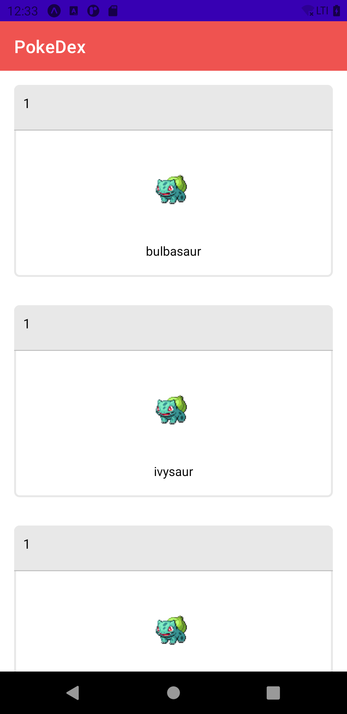

<h1 align="center">Pokedex
<br>
<br>
Pokedex app feito em Kotlin
</h1>

## About
<p>Pensei em fazer um projeto que junte as principais atualizações no desenvolvimento para Android, atualmente programo utilizando Java e nunca usei as novas features, decidi aprender e criar algo legal no processo, se você está aqui e tem uma sugestão para melhorias ou recomendações, sinta-se a vontade para compartilhar. A pokedex ainda não está finalizada, vou construindo ela aos poucos. </p>

## Screenshots
<p>
  
</p>


## Development Roadmap
 - [x] [Kotlin](https://kotlinlang.org/)
 - [x] [LiveData](https://developer.android.com/topic/libraries/architecture/livedata)
 - [x] [ViewModel](https://developer.android.com/topic/libraries/architecture/viewmodel)
 - [x] [RecyclerView](https://developer.android.com/guide/topics/ui/layout/recyclerview)
 - [x] [Retrofit](https://square.github.io/retrofit/)
 - [x] [PokeApi](https://pokeapi.co/)
 - [x] [ViewBinding](https://developer.android.com/topic/libraries/view-binding)
 - [x] [MVVM](https://developer.android.com/jetpack/guide)
 - [ ] UnitTests
 - [ ] [Navigation](https://developer.android.com/topic/libraries/architecture/navigation)
 - [ ] [Fragments](https://developer.android.com/guide/fragments)

# Features
 - [x] Pokedex
 - [ ] Pokedex Search
 - [ ] Pokemon Detail

## Logbook
<h4>Journey</h4>
Aqui vou tentar colocar os principais problemas que eu me deparei implementando alguma feature, algo que seja interessante de escrever, e como eu consegui resolver. Talvez eu coloque também algumas dúvidas que eu não vou saber responder no momento, então caso você saiba explicar e tiver um tempinho não deixe de criar uma issue ou abrir um pull request.

## License
All the code available under the MIT license. See [LICENSE](LICENSE).

```
MIT License

Copyright (c) 2021 Enzo Augusto

Permission is hereby granted, free of charge, to any person obtaining a copy
of this software and associated documentation files (the "Software"), to deal
in the Software without restriction, including without limitation the rights
to use, copy, modify, merge, publish, distribute, sublicense, and/or sell
copies of the Software, and to permit persons to whom the Software is
furnished to do so, subject to the following conditions:

The above copyright notice and this permission notice shall be included in all
copies or substantial portions of the Software.

THE SOFTWARE IS PROVIDED "AS IS", WITHOUT WARRANTY OF ANY KIND, EXPRESS OR
IMPLIED, INCLUDING BUT NOT LIMITED TO THE WARRANTIES OF MERCHANTABILITY,
FITNESS FOR A PARTICULAR PURPOSE AND NONINFRINGEMENT. IN NO EVENT SHALL THE
AUTHORS OR COPYRIGHT HOLDERS BE LIABLE FOR ANY CLAIM, DAMAGES OR OTHER
LIABILITY, WHETHER IN AN ACTION OF CONTRACT, TORT OR OTHERWISE, ARISING FROM,
OUT OF OR IN CONNECTION WITH THE SOFTWARE OR THE USE OR OTHER DEALINGS IN THE
SOFTWARE.
```
